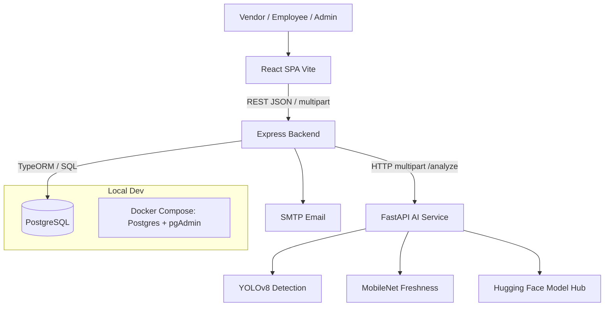

# CodeGen International Interview Preparation — SnapStock-AI

This guide prepares you to discuss the **SnapStock-AI** project in a CodeGen-style interview. It focuses on project architecture, technology choices, OOP, design patterns, authentication, **databases (normalization, keys, relationships, ACID, SQL, indexing)**, APIs, deployment, challenges, and improvements.

It intentionally does not cover coding problems or DSA.

**Related deeper notes:** `docs/INTERVIEW-OOP-GOF-NORMALIZATION.md`, `docs/MID-EVALUATION-GUIDE.md`, `docs/DESIGN-PATTERNS-AND-OOP.md`

---

## 1. The Most Important Rule

Do not memorize definitions only. Use this structure when answering:

1. Explain the concept simply.
2. Identify where it appears in SnapStock-AI.
3. Explain why it was useful.
4. Mention one limitation or improvement.

For example:

> The Repository pattern separates data access from business rules. In SnapStock-AI, `AuthService.login` asks `AuthRepository.findByEmail` instead of writing SQL in the service. That keeps bcrypt and JWT logic free of TypeORM details. One limitation is that detection still has an empty repository stub because scan results are not persisted yet.

That answer is stronger than only giving the textbook definition.

---

## 2. Short Project Introduction

### 30-second version

> SnapStock-AI is an AI-powered inventory and freshness monitoring system for small fruit and vegetable retailers. It uses a React web client, a Node.js Express backend, a Python FastAPI AI service, and PostgreSQL. Vendors capture shelf photos; YOLOv8 detects and counts produce; MobileNet classifies freshness. We also implemented JWT authentication with email verification and password reset.

### 60–90-second version

> SnapStock-AI helps small retailers who still count stock manually and guess freshness by eye. Our team built a multi-tier prototype: React for the dashboard and camera upload, Express as the trusted API boundary, FastAPI for YOLO detection and MobileNet freshness, and PostgreSQL for users and related auth data.
>
> The Express backend is a modular monolith with auth and detection modules structured as routes, controllers, services, and repositories. The AI service is separate because TensorFlow and Ultralytics fit Python better and inference should not block login APIs.
>
> So far, authentication is end-to-end and the scan path works through Express into `/analyze`. Inventory alerts and full multi-tenant APIs are designed and partly in the UI, but not fully persisted yet. Local development uses Docker Compose for PostgreSQL and pgAdmin.

### If they ask for your contribution

Answer only with work you personally completed:

> My main contribution was **[auth / AI / frontend / diagrams — fill honestly]**. I worked on **[specific files]**, solved **[specific problem]**, and coordinated through Git branches and PR reviews. I can also explain the full architecture because the client, Express, PostgreSQL, and FastAPI communicate through clear interfaces.

Do not claim every feature if it was team work.

---

## 3. Is This a Monolith or Microservices Architecture?

### Best direct answer

> It is a **hybrid architecture**: the Express backend is a **modular monolith**, while AI inference is a separate **FastAPI microservice**. It is not a pure monolith and not a full microservices system.

### Why Express is a modular monolith

Modules today:

- Authentication
- Detection gateway

They:

- Run in one Node process
- Share one PostgreSQL database
- Are released together
- Follow the same layered folder pattern

### Why FastAPI is a separate service

- Separate process and dependency set
- HTTP communication
- Can restart independently
- Owns model loading and inference

### Why this is not full microservices

We do not have separate deployable services for inventory, alerts, auth, and analytics each with their own databases.

**Say:**

> Modular monolith for business API + extracted ML service.

**Do not say:**

> Full microservices architecture.

### Architecture diagram



---

## 4. Important End-to-End Flows

### Login

1. React `AuthContext.login` posts email/password.
2. Express `/auth/login` → controller → `AuthService`.
3. Repository finds user by email.
4. `bcrypt.compare` checks password.
5. Service rejects if email not verified.
6. JWT signed with `userId`, `email`, `system_role`.
7. Client stores token in localStorage.
8. `ProtectedRoute` allows `/dashboard`.

### Scan analysis

1. User selects shelf and captures/uploads image.
2. React posts multipart to `/detection/analyze`.
3. Express multer reads file; `DetectionService` proxies to FastAPI `/analyze`.
4. YOLO detects → crops → MobileNet freshness per crop.
5. JSON returns to client and is displayed.
6. Results are **not fully persisted** yet — say this honestly.

### Registration + email verification

1. Register hashes password with bcrypt.
2. Creates user + verification token (1 hour).
3. SMTP sends link.
4. Verify endpoint marks `email_verified` and deletes token.

---

## 5. Why We Chose Each Technology

| Tech | Ready-to-say reason | Tradeoff |
|------|---------------------|----------|
| **React** | Interactive dashboard, camera UI, reusable components | Client-only auth guard is not enough alone |
| **Node/Express** | I/O APIs, JWT, uploads, orchestration | Not ideal for heavy ML CPU work |
| **TypeORM** | TypeScript entities + repositories | Need migrations (`synchronize: false`) |
| **PostgreSQL** | Relational integrity, multi-tenant keys, ACID | Stricter schema than Mongo |
| **FastAPI** | Python ML ecosystem, typed schemas | Extra network hop |
| **YOLOv8** | Real-time detection + counting | Model size / CPU latency |
| **MobileNet** | Lightweight freshness on CPU | Current labels are good/bad, not 3-class |
| **Docker Compose** | Local Postgres/pgAdmin | App services still run on host in dev |
| **JWT + bcrypt** | Stateless auth + safe password storage | Logout does not blacklist access tokens |

---

## 6. OOP Concepts in This Project

### Encapsulation

> Related data and behavior stay together; internals stay hidden.

**Where:** Controllers do not call bcrypt or SQL. `AuthService` hashes passwords; `AuthRepository` runs TypeORM queries; `email.ts` hides SMTP.

**Why useful:** Change hash cost or queries in one place.

**Limitation:** Services often use static methods; full dependency injection can still improve testability.

### Abstraction

> Callers use simple interfaces, not low-level steps.

**Where:** DTOs (`RegisterDTO`), Pydantic `AnalysisResponse`, `apiRequest()`, `/analyze` facade.

**Why useful:** Client does not know YOLO thresholds or TypeORM.

### Inheritance

> Specialized type extends a base type.

**Where:** `AuthRequest extends Request`; custom exceptions extend `Exception` / `ValueError`; Pydantic `BaseModel`.

**Why useful:** Reuse framework contracts.

**Limitation:** We avoid deep business inheritance; prefer composition.

### Polymorphism

> Same operation, different concrete behavior/shapes.

**Where:** Shared Express handler signature; different DTOs/schemas for login vs register vs analyze.

**Note:** Prefer saying practical polymorphism, not Java-style overloading.

---

## 7. Design Patterns Actually Used

Focus on defendable patterns.

### Facade (GoF)

`/analyze` hides detect → crop → classify → aggregate.

**File:** `ai-service/app/analysis/service.py`

### Proxy / Gateway (GoF-like)

Express `DetectionService` forwards images to FastAPI; browser never calls AI.

**File:** `server/src/modules/detection/detection.service.ts`

### Singleton-style shared models (GoF-like)

Models loaded once at FastAPI lifespan + `@lru_cache`.

**Files:** `ai-service/app/main.py`, `detection/model_loader.py`

### Repository (enterprise, not GoF)

`AuthRepository` isolates persistence.

### Service Layer (enterprise)

`AuthService`, `DetectionService`, `analyze_image`.

### Chain of Responsibility-style middleware

`authMiddleware` verifies JWT then `next()` — **written; not fully wired to detection**.

### Provider / Guard (frontend)

`AuthContext`, `ProtectedRoute`.

### Patterns to mention carefully or as future

- **Factory** for auth tokens (good improvement)
- **Strategy** for interchangeable detectors (informal today)
- **Observer** for alerts (designed, not implemented)

---

## 8. SOLID (Honest)

| Principle | In project | Improvement |
|-----------|------------|-------------|
| **SRP** | Routes/controllers/services/repos separated | Keep filling empty detection repository only when persisting |
| **OCP** | New module folder for new features | Avoid editing auth for unrelated features |
| **LSP** | Limited inheritance; keep contracts consistent | — |
| **ISP** | DTOs are small | Good |
| **DIP** | Partial (models passed into analyze) | Inject `AiClient` interface for tests |

---

# 9. DATABASE SECTION (Interview Core)

This is the section interviewers often dig into. Learn it well.

## 9.1 List of main tables and important columns

### Implemented / migrated today

#### `users`
Important columns:

- `id` (UUID)
- `full_name`
- `email` (unique)
- `password_hash`
- `nic` (unique, nullable)
- `date_of_birth` (nullable)
- `email_verified`
- `system_role` (`SYSTEM_ADMIN` | `BUSINESS_USER`)
- `created_at`, `updated_at`, `deleted_at`

#### `businesses`
- `id`
- `business_name`
- `business_email`
- `address`
- `contact_number`
- timestamps + `deleted_at`
- unique `(business_name, address)`

#### `business_users` (membership)
- `business_id`
- `user_id`
- `role` (`OWNER` | `EMPLOYEE`)
- `joined_at`

#### `email_verification_tokens`
- `id`
- `user_id`
- `token` (unique)
- `expires_at`
- `created_at`

#### `password_reset_tokens`
- `id`
- `user_id`
- `token` (unique)
- `expires_at`
- `created_at`

#### `employee_invitations`
- `id`
- `business_id`
- `invited_by`
- `email`
- `role`
- `invitation_token` (unique)
- `status` (`PENDING` | `ACCEPTED` | `EXPIRED` | `CANCELLED`)
- `expires_at`, `accepted_at`, `created_at`

### Designed / UI-mocked but not fully in migrations yet

Say this honestly if asked:

- `scans`, `detections`, `shelves`, `products`, `alerts`, `inventory`

---

## 9.2 Primary Keys and Foreign Keys

| Table | Primary Key | Foreign Keys |
|-------|-------------|--------------|
| `users` | `id` | — |
| `businesses` | `id` | — |
| `business_users` | `(business_id, user_id)` composite | `business_id → businesses.id`, `user_id → users.id` |
| `email_verification_tokens` | `id` | `user_id → users.id` |
| `password_reset_tokens` | `id` | `user_id → users.id` |
| `employee_invitations` | `id` | `business_id → businesses.id`, `invited_by → users.id` |

**ON DELETE CASCADE** is used on several FKs so deleting a user/business cleans dependent rows.

---

## 9.3 Relationships (speak these clearly)

### One-to-Many

**User → Email verification tokens**

> One user can have multiple verification token rows over time (resend creates new tokens). Each token belongs to exactly one user.

**User → Password reset tokens**

> Same idea for reset tokens.

**Business → Employee invitations**

> One business can send many invitations. Each invitation belongs to one business.

**User → Invitations sent (`invited_by`)**

> One owner/user can invite many employees.

### Many-to-Many

**Users ↔ Businesses through `business_users`**

> A user can belong to multiple businesses in the target design, and a business can have many users. The join table stores the role (`OWNER` / `EMPLOYEE`). That is classic many-to-many with attributes on the relationship.

### One-to-One (soft / practical)

Not a hard DB 1:1 constraint, but conceptually:

> A login session identity maps to one `users` row. JWT carries one `userId`.

### Ready-to-say summary

> Core multi-tenant idea is many-to-many membership. Auth tokens are one-to-many from users. Invitations are one-to-many from businesses.

---

## 9.4 Textual ER diagram (easy to draw)

Draw this on paper:

```text
                    ┌─────────────────┐
                    │   businesses    │
                    │ PK id           │
                    │ name, email...  │
                    └────────┬────────┘
                             │ 1
                             │
                             │ M
                    ┌────────┴────────┐
                    │ business_users  │
                    │ PK (biz,user)   │
                    │ role OWNER/EMP  │
                    └────────┬────────┘
                             │ M
                             │
                             │ 1
┌──────────────┐    ┌────────┴────────┐
│ email_verif. │ M  │     users       │
│ PK id        ├────┤ PK id           │
│ FK user_id   │    │ email UNIQUE    │
└──────────────┘    │ password_hash   │
                    │ system_role     │
┌──────────────┐  M │ email_verified  │
│ pwd_reset    ├────┤                 │
│ PK id        │    └────────┬────────┘
│ FK user_id   │             │ 1
└──────────────┘             │
                             │ M
                    ┌────────┴────────┐
                    │ employee_invites│
                    │ FK business_id  │
                    │ FK invited_by   │
                    └─────────────────┘
```

**Spoken walkthrough:**

> Users and businesses are separate entities. Membership is the association table. Tokens hang off users. Invitations hang off businesses and also reference who invited.

---

## 9.5 Normalization (1NF, 2NF, 3NF) with project examples

### First Normal Form (1NF)

**Meaning:** Atomic values; no repeating groups in one cell.

**Project example:**

> `users.email` stores one email, not `a@x.com,b@y.com`. We do not store a comma-separated list of business IDs inside the user row.

### Second Normal Form (2NF)

**Meaning:** Be in 1NF; no partial dependency on part of a composite key.

**Project example:**

> `business_users` has composite key `(business_id, user_id)`. The `role` depends on the **whole membership**, not only on `user_id`. User name stays in `users`, not duplicated as a dependent of half the key.

### Third Normal Form (3NF)

**Meaning:** Be in 2NF; non-key fields do not depend on other non-key fields.

**Project examples:**

> Business address lives in `businesses`, not copied into every membership.  
> Token expiry lives in token tables, not as repeating columns on `users`.  
> Invitation status is on `employee_invitations`, not forced into the user profile.

### Ready-to-say paragraph

> Our auth and tenant schema is designed toward 3NF. We separated users, businesses, memberships, and tokens so each fact has one place. That reduces update anomalies—for example, changing a business address does not require updating many user rows.

---

## 9.6 Why this design is good

1. **Clear tenant boundary** — `business_id` ready for isolation.  
2. **Integrity** — FKs and unique email prevent orphaned/duplicate accounts.  
3. **Security tables separated** — tokens expire and delete without bloating `users`.  
4. **Role on relationship** — OWNER vs EMPLOYEE is membership data.  
5. **Matches TypeORM entities** — code maps cleanly to tables.  
6. **Extensible** — future `scans` can FK to `business_id` and `user_id`.

---

## 9.7 Possible improvements / intentional denormalization later

### Improvements

- Persist `scans` and `detections` with FKs.
- Enforce JWT + always filter by `business_id`.
- Create business + OWNER membership inside the same registration transaction.
- Consider hashing email/reset tokens at rest (currently stored as random hex tokens).

### What you might denormalize and why

> For dashboards, we might store a denormalized `last_freshness_summary` on a product/shelf row to avoid recalculating from all detections on every page load. Bounding boxes may be JSONB for practical nested geometry. That is controlled denormalization for read performance—not because we rejected 3NF for core entities.

---

## 9.8 ACID using a real project transaction (and honesty)

### ACID meanings (simple)

- **Atomicity** — all steps succeed or none  
- **Consistency** — constraints remain valid  
- **Isolation** — concurrent logins/registers don’t corrupt rows  
- **Durability** — committed data survives restart  

### Best current example (registration)

Ready-to-say:

> During registration we create a user, then a verification token, then send email. Ideally those DB writes are one transaction: if token insert fails, the user insert should roll back so we never leave a user without a consistent verification path. PostgreSQL supports that; TypeORM can wrap it in a query runner transaction. Email sending should stay outside the DB transaction because SMTP is external.

### Stronger future example (scan completion)

> When we persist scans, a good ACID unit is: insert scan COMPLETED + insert detections + update inventory quantities in one transaction. If AI succeeds but inventory update fails, we should not commit partial stock changes. Today the AI path returns results without that full persistence transaction—so I would describe it as the designed ACID boundary for the next sprint.

### Isolation note

> Unique email constraints prevent two concurrent registrations from creating two users with the same email; one insert fails.

---

## 9.9 Sample SQL interviewers ask (with answers)

### Q1. Find a user by email for login

```sql
SELECT id, full_name, email, password_hash, system_role, email_verified
FROM users
WHERE email = 'priya@example.com'
  AND deleted_at IS NULL;
```

### Q2. List all employees of a business

```sql
SELECT u.id, u.full_name, u.email, bu.role, bu.joined_at
FROM business_users bu
JOIN users u ON u.id = bu.user_id
WHERE bu.business_id = 'BUSINESS-UUID'
  AND bu.role = 'EMPLOYEE';
```

### Q3. Businesses owned by a user

```sql
SELECT b.id, b.business_name, b.address
FROM businesses b
JOIN business_users bu ON bu.business_id = b.id
WHERE bu.user_id = 'USER-UUID'
  AND bu.role = 'OWNER'
  AND b.deleted_at IS NULL;
```

### Q4. Delete expired verification tokens (cleanup)

```sql
DELETE FROM email_verification_tokens
WHERE expires_at < NOW();
```

### Bonus: Count users per business

```sql
SELECT b.business_name, COUNT(bu.user_id) AS member_count
FROM businesses b
LEFT JOIN business_users bu ON bu.business_id = b.id
GROUP BY b.id, b.business_name
ORDER BY member_count DESC;
```

---

## 9.10 Indexing in this project

### What we already index

From migrations:

- `business_users(business_id)`, `business_users(user_id)`
- `email_verification_tokens(user_id)`, `(token)`, `(expires_at)`
- `password_reset_tokens(user_id)`, `(token)`, `(expires_at)`
- `employee_invitations(email)`, `(business_id)`, `(invitation_token)`, `(status)`

Unique indexes / constraints:

- `users.email`
- token uniqueness
- `(business_name, address)`

### Why

> Login looks up email often → unique email helps.  
> Token verify looks up token string → index on `token`.  
> Listing members by business → index on `business_id`.

### Tradeoff

> Indexes speed reads but add write cost and storage.

### Future indexes

- `scans(business_id, created_at)`
- `detections(scan_id)`
- `alerts(business_id, is_read)`

---

## 9.11 Authentication and password storage

### Passwords

> We never store plain text. On register, `bcrypt.hash(password, 10)` stores `password_hash`. On login, `bcrypt.compare` checks the submitted password against the hash.

**File:** `server/src/modules/auth/auth.service.ts`

### JWT

> After successful verified login, we sign a JWT with `userId`, `email`, `system_role`, expiry 7 days. Client stores it and uses it for dashboard access.

### Email verification / reset

> Random 32-byte hex tokens, 1-hour expiry, stored in separate tables, emailed via Nodemailer. Forgot/resend return generic messages to reduce email enumeration.

### Roles

> `system_role` on users (`SYSTEM_ADMIN` / `BUSINESS_USER`). Business role on `business_users` (`OWNER` / `EMPLOYEE`). Enforcement of business RBAC is designed; system role is set but not fully enforced everywhere yet.

### Honest limitations

1. JWT middleware exists but is not applied to all routes (e.g. detection).  
2. Client does not always send `Authorization` header yet.  
3. Logout is mostly client-side clear; no access-token denylist.  
4. Register does not yet create business + OWNER membership in one transaction.

---

## 10. REST APIs and HTTP

### Implemented

| Method | Path | Purpose |
|--------|------|---------|
| POST | `/auth/register` | Create user + verification email |
| POST | `/auth/login` | JWT |
| POST | `/auth/logout` | Message only |
| GET | `/auth/verify-email` | Verify token |
| POST | `/auth/resend-verification` | Resend |
| POST | `/auth/forgot-password` | Reset email |
| POST | `/auth/reset-password` | New password |
| POST | `/detection/analyze` | Proxy to AI |

AI: `/analyze`, `/detect`, `/predict`, `/health`

### Status codes you can mention

- 200/201 success  
- 400 validation/business errors  
- 401 missing/invalid token (middleware)  
- 413/415 image size/type from AI  

---

## 11. Deployment

### Local

- Docker Compose: PostgreSQL + pgAdmin  
- Host processes: Vite `:5173`, Express `:5000`, FastAPI `:8000`

### Why not expose AI publicly

> Browser talks only to Express. That keeps AI internal and lets Express apply auth later.

### Production target (designed)

Nginx TLS → static client + API; private AI and DB networks.

---

## 12. Testing (honest)

> We do not yet have a strong automated test suite. I would prioritize unit tests for `AuthService` password rules and AI schema validation, plus integration tests for login and analyze proxy.

---

## 13. Challenges and Strong Answers

### Challenge 1: ML stack vs Node

> TensorFlow/YOLO belong in Python. We extracted FastAPI and proxied from Express.

### Challenge 2: Model cold start

> Load once at lifespan / cache loader. First download from Hugging Face can be slow.

### Challenge 3: Prototype vs full SaaS

> Auth + AI scan first. Dashboard mocks for inventory/alerts. Schema for businesses ready ahead of APIs.

### Challenge 4: Python version / TensorFlow wheels

> Newer Python (e.g. 3.14) may not support TensorFlow; use 3.10–3.12 for AI venv.

---

## 14. Honest Weaknesses and Improvements

1. Wire JWT middleware + client `Authorization` header.  
2. Persist scans/detections with transactional inventory updates.  
3. Create business + OWNER on register in one DB transaction.  
4. Add Zod validation and Helmet.  
5. Automated tests.  
6. Three-class freshness if required by SRS.  
7. Hash tokens at rest; shorter JWT lifetime; refresh tokens optional.

---

## 15. Likely Questions and Model Answers

### Explain your architecture

> React SPA → Express modular monolith → PostgreSQL; Express proxies images to FastAPI for YOLO + MobileNet. Hybrid modular monolith + ML microservice.

### Why PostgreSQL not MongoDB?

> We need relational integrity for users, businesses, memberships, and tokens. Foreign keys and unique constraints fit multi-tenant relational design. Mongo would be more flexible for nested scan documents, but our core identity model is relational.

### Is the DB normalized?

> Toward 3NF for auth and tenant tables: separate users, businesses, association table, and token tables. Future scan JSON bounding boxes may be deliberate denormalization.

### Show a many-to-many

> `business_users` links users and businesses with role.

### How are passwords stored?

> bcrypt cost 10 hashes only; compare on login.

### Where is Facade?

> FastAPI `/analyze` orchestrates detection and freshness behind one endpoint.

### Where is Proxy?

> Express detection service calls AI service.

### What would you improve in DB?

> Persist scans in a transaction with detections and inventory updates; always scope by `business_id`.

---

## 16. Questions You Can Ask Them

- How does CodeGen decide modular monolith vs more services?  
- How do you handle multi-tenant data isolation in production?  
- What testing standard do interns follow in the first months?  
- How do you review schema migrations in PRs?

---

## 17. Files to Review Before Interview

### Architecture

- `README.md`
- `docker-compose.yml`
- `server/src/index.ts`
- `ai-service/app/main.py`

### Auth

- `server/src/modules/auth/auth.service.ts`
- `server/src/modules/auth/auth.repository.ts`
- `server/src/entities/User.ts`
- `server/src/shared/middleware/auth.middleware.ts`
- `client/src/context/AuthContext.tsx`

### AI / Proxy / Facade

- `server/src/modules/detection/detection.service.ts`
- `ai-service/app/analysis/service.py`
- `ai-service/app/detection/detector.py`
- `ai-service/app/freshness/predictor.py`

### Database

- `server/migrations/001_create_users_table.ts`
- `server/migrations/002_create_businesses_table.ts`
- `server/migrations/003_create_business_users_table.ts`
- `server/migrations/006_create_email_verification_tokens_table.ts`
- `server/migrations/008_create_password_reset_tokens_table.ts`
- `server/migrations/004_create_employee_invitations_table.ts`

---

## 18. Claims to Avoid

| Avoid | Prefer |
|-------|--------|
| Full microservices | Modular monolith + AI microservice |
| Fully normalized forever including future JSON | Toward 3NF for core tables; controlled denormalization later |
| Logout kills JWT instantly | Client clears token; no denylist yet |
| Detection is authenticated | Middleware exists; not fully wired |
| Inventory fully works | UI mock / designed; persistence remaining |
| All GoF patterns | Facade, Proxy, Singleton-style + Repository/Service |

---

## 19. Final Revision Checklist

Before the interview, explain without notes:

- [ ] 30-second project pitch  
- [ ] Your real contribution  
- [ ] Hybrid architecture  
- [ ] Login flow  
- [ ] Scan proxy + `/analyze` facade  
- [ ] Tables, PKs, FKs  
- [ ] One-to-many and many-to-many examples  
- [ ] Draw the ER sketch  
- [ ] 1NF / 2NF / 3NF with SnapStock examples  
- [ ] One ACID story + one honesty gap  
- [ ] Two SQL queries from memory  
- [ ] Indexes you have  
- [ ] bcrypt + JWT  
- [ ] Three improvements  

### Final answering structure

> **Concept → SnapStock-AI example → Why we used it → Limitation or improvement**

That structure shows understanding, not memorization.
